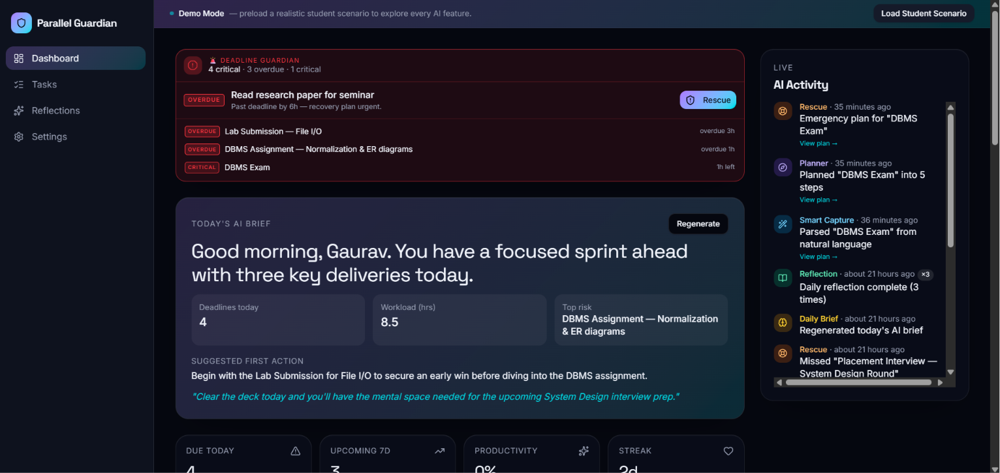
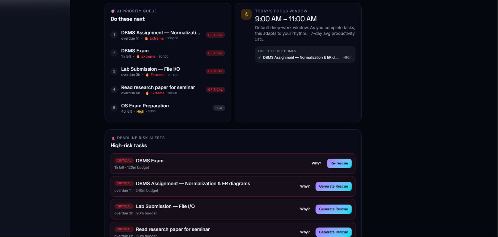
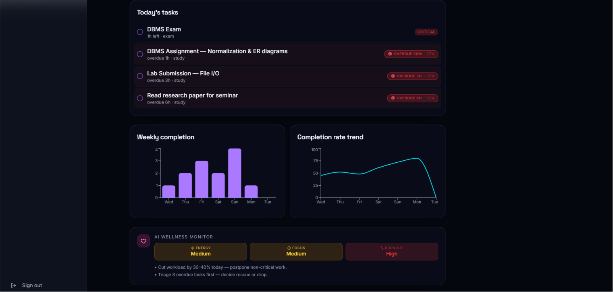
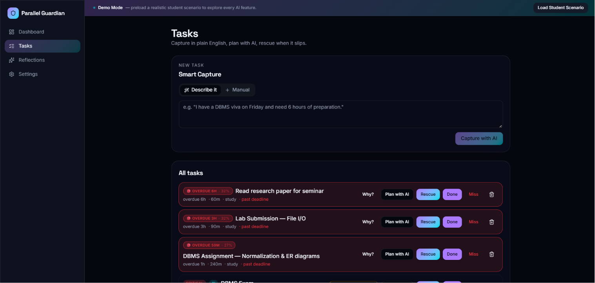
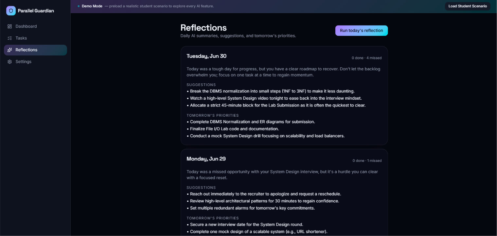
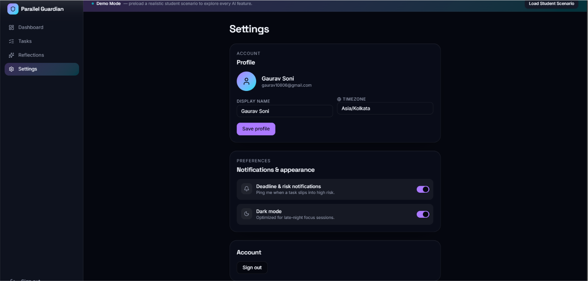

# 🛡️ Parallel Guardian AI

> An AI-powered student productivity companion that predicts deadline risks, prioritizes tasks intelligently, and rescues students before they miss important academic commitments.

## 🌐 Live Demo

🔗 [Try Parallel Guardian AI Here] https://parallel-guardian-ai.vercel.app

---

## 📖 Problem Statement

Students constantly juggle assignments, exams, projects, interviews, and personal commitments. Traditional to-do apps simply store tasks but fail to:

- Predict which tasks are at risk.
- Prioritize work intelligently.
- Adapt to changing schedules.
- Provide actionable recovery plans when deadlines slip.
- Encourage self-reflection and continuous improvement.

Parallel Guardian AI addresses these challenges by acting as an intelligent academic assistant that continuously analyzes workload and guides students toward better productivity decisions.

---

# ✨ Key Features

## 🧠 AI Daily Brief

Generates an intelligent daily summary including:

- Today's deadlines
- Estimated workload
- Highest risk task
- Recommended first action
- Personalized productivity advice

---

## 🚨 Deadline Guardian

Automatically identifies:

- Overdue tasks
- Critical deadlines
- High-risk assignments
- Upcoming academic bottlenecks

Provides rescue actions before failure occurs.

---

## 🎯 AI Priority Queue

Uses AI-driven prioritization to determine:

- What should be done next
- Task urgency level
- Deadline severity
- Workload balancing

Students always know what deserves attention first.

---

## ⏰ Adaptive Focus Window

Suggests personalized deep-work sessions based on:

- Task urgency
- Historical productivity
- Workload intensity

Helps students maximize focus and reduce procrastination.

---

## 📝 Smart Task Capture

Students can describe tasks in natural language.

Example:

> "I have my DBMS viva on Friday and need around 6 hours of preparation."

The AI automatically extracts:

- Task title
- Deadline
- Estimated duration
- Priority

---

## 🆘 Rescue Planner

When a task becomes overdue, the AI generates:

- Recovery strategies
- Step-by-step action plans
- Suggested workload redistribution

Helping students recover instead of giving up.

---

## 📊 Productivity Analytics

Tracks:

- Weekly completion rate
- Productivity trends
- Task completion history
- Streak maintenance

Provides insights into long-term performance.

---

## ❤️ Wellness Monitor

Monitors productivity health indicators:

- Energy level
- Focus level
- Burnout risk

Offers suggestions to maintain sustainable productivity.

---

## 📓 AI Reflection Journal

Generates daily reflections including:

- Progress summary
- Missed commitments
- Improvement suggestions
- Tomorrow's priorities

Encourages continuous learning and self-improvement.

---

# 🛠️ Tech Stack

| Category | Technology |
|----------|------------|
| Frontend | React |
| Language | TypeScript |
| Build Tool | Vite |
| Styling | Tailwind CSS |
| UI Components | shadcn/ui |
| State Management | React Hooks |
| Charts | Recharts |
| Deployment | Lovable |
| AI Prototyping | Google AI Studio |

---

# 📷 Screenshots

## Dashboard Overview



---

## AI Priority Queue & Deadline Alerts



---

## Productivity Analytics & Wellness Monitoring



---

## Smart Task Management



---

## AI Reflection Journal



---

## User Settings



---

# 🚀 Getting Started

## Clone Repository

```bash
git clone https://github.com/Gaurav10806/parallel-guardian-ai.git
```

```bash
cd parallel-guardian-ai
```

## Install Dependencies

```bash
npm install
```

## Run Development Server

```bash
npm run dev
```

Application will run on:

```bash
http://localhost:5173
```

---

# 📂 Project Structure

```bash
parallel-guardian-ai/
│
├── assets/
├── src/
│   ├── components/
│   ├── hooks/
│   ├── routes/
│   ├── integrations/
│   └── lib/
│
├── public/
├── supabase/
├── package.json
└── README.md
```

---

# 🎯 Target Users

- College students
- University students
- Competitive exam aspirants
- Internship seekers
- Learners managing multiple deadlines

---

# 🔮 Future Enhancements

- Google Calendar integration
- Gmail integration
- Push notifications
- Mobile application
- AI-powered timetable generation
- Collaborative study groups
- Voice assistant support

---

# 👨‍💻 Author

**Gaurav Soni**

GitHub: https://github.com/Gaurav10806

---

# 📄 License

This project is developed for educational and hackathon purposes.

---

## ⭐ If you like this project, consider giving it a star!
